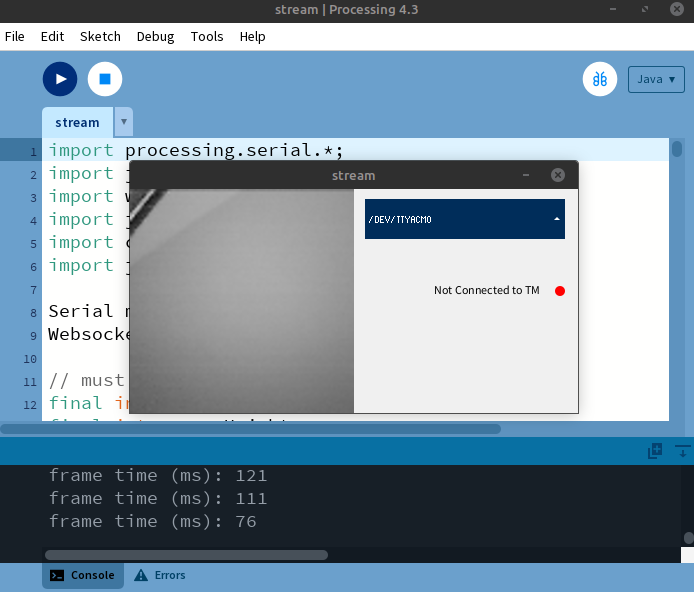
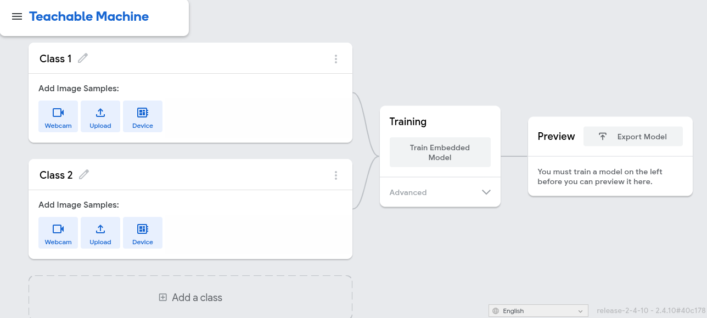
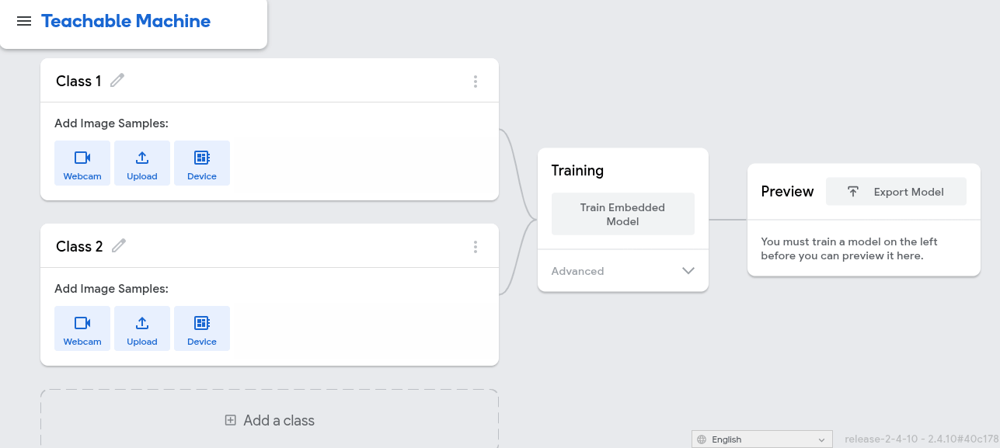

# teachable-senseBox-Eye
This is a tutorial for training an image classification model using Teachable Machines and deploying it to senseBox Eye.

## required software
- [Arduino IDE 2](https://docs.arduino.cc/software/ide-v2/tutorials/getting-started/ide-v2-downloading-and-installing/)
    - board: "senseBox Eye" included in the board manager "esp32"
    - libraries: Adafruit GFX Library, Adafruit SSD1306, [Arduino_TensorFlowLite](https://github.com/tensorflow/tflite-micro-arduino-examples#how-to-install)
- [Processing IDE](https://processing.org/download)
    - libraries: ControlP5, Websockets
- [Google Chrome](https://www.google.com/chrome/)

## required hardware
- senseBox Eye
- OLED-Display
- QWIIC cable
- USB-C cable

Connect the OLED-Display to the senseBox Eye with the QWIIC cable. Connect the senseBox Eye to your computer with the USB-C cable and turn it on.

## tutorial
### 1. Collecting a dataset
#### 1.1 Capture images with the senseBox Eye
Open the folder `train/camera-capture` and open the file `camera-capture.ino` with the Arduino IDE 2. Choose "sensebox Eye" as the board. Compile and Upload. Make sure the Serial Monitor is NOT open.

#### 1.2 Receive images and stream
Open the folder `train/stream`and open the file `stream.pde` with the Processing IDE. Run the script. In the subsequent window, select the port at which the senseBox Eye is connected. You should see a camera image.

### 2. Train
Open [https://teachablemachine.withgoogle.com/](https://teachablemachine.withgoogle.com/) in Google Chrome. Click on "Get started" and then "Image Project". Select "Embedded image model". You should see the following:

Rename "Class 1" to a name of your choosing (for example, a certain object, a gesture, a shape, etc.). Click on "Add Image Samples: Device". Click on "Attempt to connect to device". Orient the camera to see the class that you choose. Click on "Hold to Record" to record some training images for this class.

Repeat the same for one or two more classes.

Click on "Train Embedded Model".

Once the training has finished, you can try out the model performance by clicking on "Attempt to connect to device". If the model misclassifies a lot, consider collecting more images for the individual classes.

Once you are satisfied with the model, click on "Export Model". Then choose the tab "Tensorflow Lite" and in there choose "Tensorflow Lite for Microcontrollers". Then click on "Download my model".

### 3. Deploy
You should have now downloaded a folder "converted_tinyml.zip". Extract it at a location of your choosing and open the folder. Copy the following 4 files:
- `model_settings.cpp`
- `model_settings.h`
- `person_detect_model_data.cpp`
- `person_detect_model_data.h`

Now, come back into this repository and open the folder `deploy`. In there, remove the existing 4 files and replace them with the ones you just copied.

Now open `deploy/senseBox-Eye-deploy.ino` in the Arduino IDE. Choose "sensebox Eye" as the board. If your image stream using the Processing IDE is still running, stop it and restart the senseBox Eye. Then compile and upload the deployment script.

On the OLED-Display, you should now see the camera image on the left and the classification on the right.

